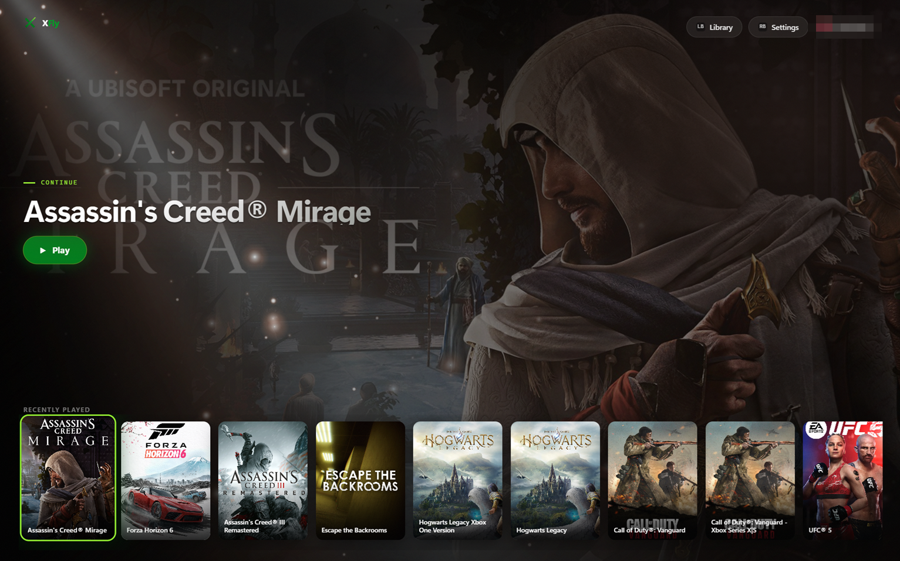
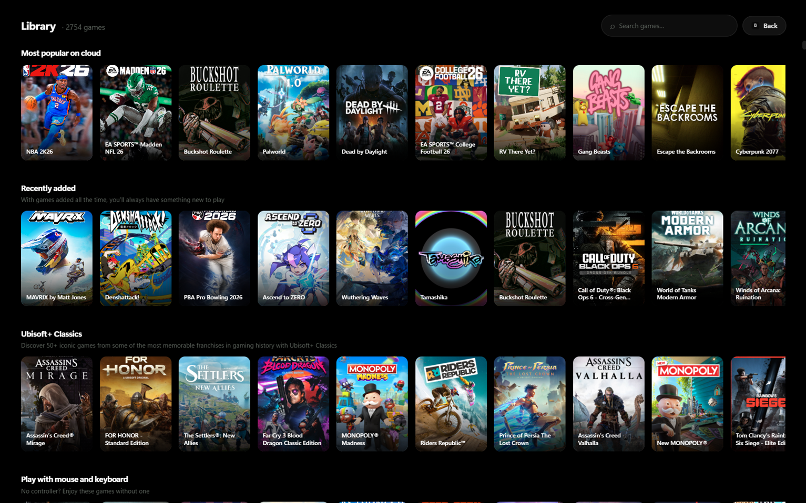
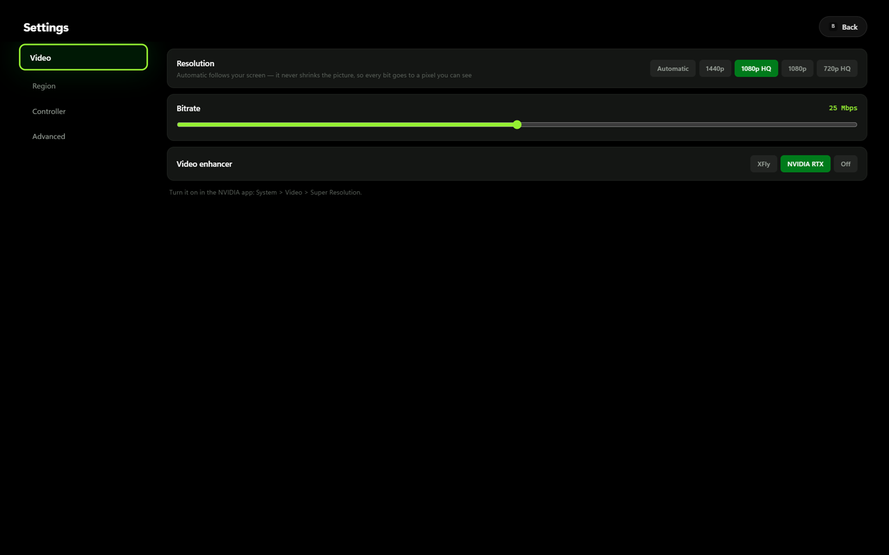

# XFly

### Xbox Cloud Gaming, as a console — not a browser tab.

**Your whole library, one screen, nothing to install.**

XFly is a Windows app that plays your cloud library on your own screen, with your own controller,
without a website in the way. It signs you in with your Microsoft account and then gets out of the way.

 

---

## AI Upscaling

### 1440p in. 4K out.

Xbox Cloud Gaming streams at up to 1440p — and on a 4K screen, that normally means a 1440p picture
stretched to fit, which looks exactly like what it is.

XFly doesn't stretch it. Your **NVIDIA RTX** or **AMD Radeon** rebuilds every frame with AI while you
play, up to your screen's real resolution. A 4K monitor gets a 4K picture. At a full 60fps. Nothing
dropped to pay for it.

| | Without | With XFly |
|---|---|---|
| **What arrives** | up to 1440p | up to 1440p |
| **What you see on a 4K screen** | 1440p, stretched | rebuilt to 4K, by your GPU |
| **Frame rate** | 60fps | 60fps — the upscale is free |
| **On a bad night** | blocking, smearing | cleaned before it's scaled |

**No RTX or Radeon?** XFly does the cleanup itself, on any machine — so the picture still arrives
without the blocking and the fuzz that crawls around edges.

---

## Key Features

<table>
<tr><td width="50%" valign="top">

###  A sharper picture

Your RTX or Radeon does the work. 1440p that actually looks like 1440p — or 4K, if that's your screen.

</td><td width="50%" valign="top">

###  Clean on a bad night

No blocking, no smearing around the edges — with or without a fancy card.

</td></tr>
<tr><td width="50%" valign="top">

###  The resolution you chose

And it stays there. No quiet slide down to 720p halfway through.

</td><td width="50%" valign="top">

###  Works in your country

Not on Microsoft's list? It still works.

</td></tr>
<tr><td width="50%" valign="top">

###  Controller only

Every screen, every menu. You'll never reach for the mouse.

</td><td width="50%" valign="top">

###  Two pads, two players

Local co-op, the way it's supposed to be.

</td></tr>
<tr><td width="50%" valign="top">

###  Your language, already set

Ten of them. Nothing to configure.

</td><td width="50%" valign="top">

###  No website

Your game fills the screen. That's the whole thing.

</td></tr>
</table>

---

## Screenshots

#### Home — the game you were last playing, and one button

 

#### Library — everything you can play, one keystroke away

 

#### Settings — short, and every line of it does something

---

## How to Use

You'll need **Windows 10/11** and an **Xbox Game Pass Ultimate** subscription. That's it — XFly plays
your existing library, it doesn't replace or provide it.

<table>
<tr><th width="50%">Portable — just run it</th><th width="50%">Installer — set and forget</th></tr>
<tr><td valign="top">

**1.** Download **`XFly-portable.exe`** from the
[latest release](../../releases/latest).

**2.** Double-click it. Nothing to install, nothing to clean up afterwards.

**3.** Press **Sign in** and use your Microsoft account in the window that opens.

**4.** That's it — your library loads and you're on the home screen.

</td><td valign="top">

**1.** Download **`XFly-Setup.exe`** from the
[latest release](../../releases/latest).

**2.** Run it and pick where it goes. It installs for you only, so Windows won't ask for an
administrator.

**3.** Launch **XFly** from your Start menu or desktop.

**4.** Press **Sign in** and use your Microsoft account in the window that opens.

</td></tr>
<tr><td valign="top" colspan="2" align="center">

**Both keep themselves up to date.** New versions arrive quietly in the background — you'll never have
to come back here for one.

</td></tr>
</table>

> ###  Windows will warn you on first run
>
> XFly isn't code-signed — a certificate costs money this project doesn't have — so SmartScreen shows
> **"Windows protected your PC"**. Click **More info**, then **Run anyway**.
>
> If you'd rather not take our word for it: the entire source is right here, and every release is built
> in the open by GitHub from this exact code. Nothing is uploaded by hand.

### Getting the best picture

Open **Settings → Video** once and try the **Video enhancer** options.

| If you have | Pick | Then |
|---|---|---|
| NVIDIA RTX (20 series or newer) | **NVIDIA RTX** | Turn on Super Resolution in the NVIDIA app — XFly tells you where |
| AMD Radeon RX 7000 / 9000 | **AMD Radeon** | Turn on Video Upscale in AMD Adrenalin |
| Anything else | **XFly** | Nothing — it does the cleanup itself |

---

## Releases

> ###  Early Preview — Test Version
>
> It works, it's what I play on every day, and it is absolutely still a test build. Expect rough edges:
> some screens are prettier than others, and some things will break in ways I haven't seen yet, because
> I only have one PC, one connection and one account to try them on.

**Please report anything that goes wrong in [Issues](../../issues).** Genuinely — a bug nobody reports
is a bug that ships forever. If something freezes, looks wrong, or just feels off, open an issue and
say what you did and what happened.

It doesn't need to be a good bug report. *"I pressed this and the screen went black"* is exactly the
kind of thing we need.

**There's a log you can attach.** It's at `%AppData%\XFly\xfly-debug.log`, and it's safe to share —
email addresses, your Windows account name, and anything that could sign in as you are stripped out
before it's ever written to the file.

---

## Contribution & Feedback

This is an open project, and help is welcome — not only code.

| | |
|---|---|
|  **Found a bug?** | [Open an issue](../../issues). The more ordinary the better. |
|  **Something feels wrong rather than broken?** | Worth an issue too. Most of what makes an app pleasant is invisible until someone says *"this annoyed me"*. |
|  **Does XFly speak your language badly?** | Translations are plain text. If a phrase reads strangely in yours, one line in an issue is enough. |
|  **Want to change something?** | Pull requests are open. For anything big, start with an issue so nobody does the same work twice. |

If XFly is useful to you, a  helps other people find it.

---

### A few honest notes

XFly is an unofficial, community project. It isn't made by, endorsed by, or connected to Microsoft or
Xbox, and it gives you nothing your subscription doesn't already include — it's a different way to use
what you already pay for.

Xbox, Xbox Game Pass and Xbox Cloud Gaming are trademarks of Microsoft.

Licensed under the **[MIT License](LICENSE)**.

